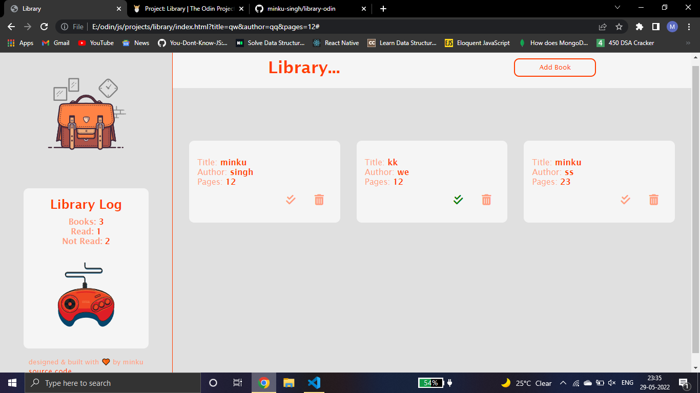

# LOCAL LIBRARY 
This is built with Vanilla JS.

## Features
- Add Book
- Remove Book
- Update Read status by clicking on check sign
- Books accessible even in the next session - localstorage used
- Library log

## Live
- [live]()

## Preview

